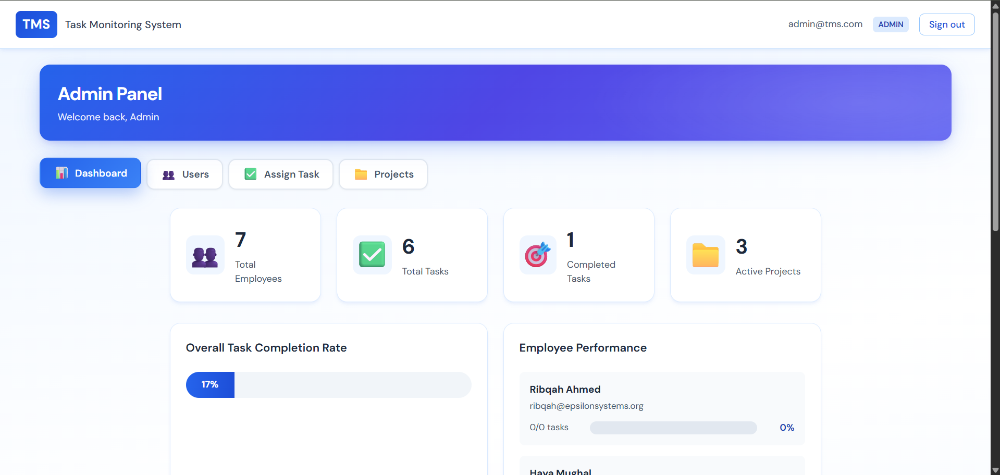
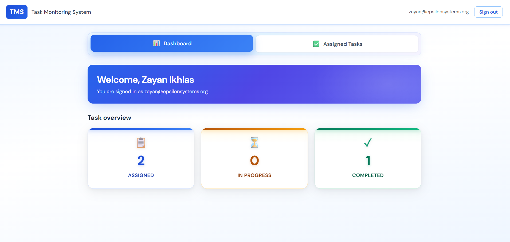
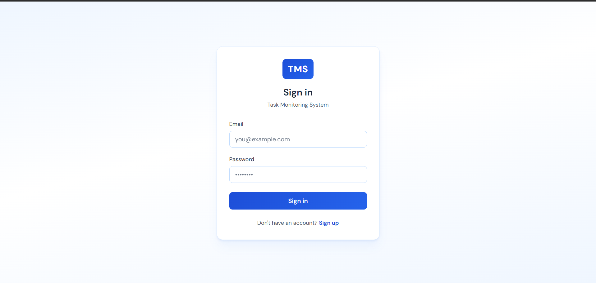

# Task Monitoring System

A full-stack task monitoring system with admin and user dashboards, built with Node.js, Express, React, and SQLite.

## Features

### Admin Features
- Performance dashboard (general and user-wise)
- Allot tasks to users
- Set deadlines for tasks
- View all tasks and manage them
- Monitor user performance metrics


### User Features
- View allotted tasks
- Update task status (Pending, In Progress, Completed)
- Personal dashboard with performance metrics
- Track overdue tasks


### Authentication
- User signup and login
- JWT-based authentication
- Role-based access control (Admin/User)


## Tech Stack

- **Backend**: Node.js, Express.js, SQLite
- **Frontend**: React, React Router, Axios
- **Authentication**: JWT (JSON Web Tokens)
- **Styling**: Custom CSS with blue and white theme

## Installation

1. **Install backend dependencies:**
   ```bash
   npm install
   ```

2. **Install frontend dependencies:**
   ```bash
   cd client
   npm install
   cd ..
   ```

   Or use the combined command:
   ```bash
   npm run install-all
   ```

## Running the Application

### Development Mode (Both Server and Client)

```bash
npm run dev
```

This will start:
- Backend server on `http://localhost:5000`
- Frontend development server on `http://localhost:3000`

### Separate Commands

**Backend only:**
```bash
npm run server
```

**Frontend only:**
```bash
npm run client
```

## Default Credentials

**Admin Account:**
- Email: `admin@taskmonitor.com`
- Password: `admin123`

**User Account:**
- Create a new account using the signup page

## Project Structure

```
task-monitoring-system/
├── server/
│   ├── database/
│   │   └── db.js          # Database initialization and connection
│   ├── middleware/
│   │   └── auth.js        # Authentication middleware
│   ├── routes/
│   │   ├── auth.js        # Authentication routes
│   │   ├── tasks.js       # Task management routes
│   │   └── dashboard.js   # Dashboard data routes
│   └── index.js           # Server entry point
├── client/
│   ├── src/
│   │   ├── context/
│   │   │   └── AuthContext.jsx  # Authentication context
│   │   ├── pages/
│   │   │   ├── Login.jsx        # Login page
│   │   │   ├── Signup.jsx       # Signup page
│   │   │   ├── AdminDashboard.jsx  # Admin dashboard
│   │   │   ├── UserDashboard.jsx   # User dashboard
│   │   │   ├── Auth.css         # Auth pages styling
│   │   │   └── Dashboard.css    # Dashboard styling
│   │   ├── App.jsx         # Main app component
│   │   ├── main.jsx        # React entry point
│   │   └── index.css       # Global styles
│   └── package.json
└── package.json
```

## API Endpoints

### Authentication
- `POST /api/auth/signup` - User registration
- `POST /api/auth/login` - User login
- `GET /api/auth/me` - Get current user

### Tasks
- `GET /api/tasks` - Get all tasks (admin sees all, users see only their tasks)
- `GET /api/tasks/:id` - Get single task
- `POST /api/tasks` - Create task (admin only)
- `PATCH /api/tasks/:id/status` - Update task status
- `PUT /api/tasks/:id` - Update task (admin only)
- `DELETE /api/tasks/:id` - Delete task (admin only)

### Dashboard
- `GET /api/dashboard/user` - Get user dashboard stats
- `GET /api/dashboard/admin` - Get admin dashboard stats

## Database Schema

### Users
- id (Primary Key)
- username (Unique)
- email (Unique)
- password (Hashed)
- role (admin/user)

### Tasks
- id (Primary Key)
- title
- description
- assigned_to (Foreign Key → users.id)
- assigned_by (Foreign Key → users.id)
- status (pending/in_progress/completed)
- deadline
- created_at
- updated_at

### Performance
- id (Primary Key)
- user_id (Foreign Key → users.id)
- task_id (Foreign Key → tasks.id)
- completed_tasks
- pending_tasks
- overdue_tasks
- record_date

## Notes

- The database file (`database.sqlite`) is created automatically on first run
- Default admin account is created automatically
- All passwords are hashed using bcrypt
- JWT tokens expire after 24 hours

## Theme

The application uses a blue and white color scheme:
- Primary Blue: `#2563eb`
- Dark Blue: `#1e40af`
- Background: White and `#f5f7fa`

